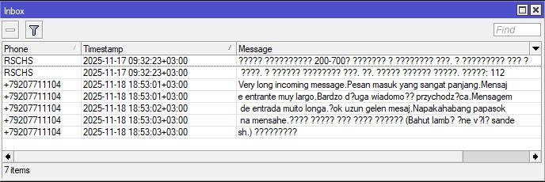
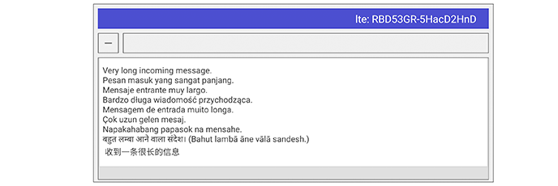

# Mikread

[](https://play.google.com/store/apps/details?id=com.safelogj.mikread)
[](https://www.youtube.com/playlist?list=PL5Ch75WcmOXTx-dNMVtK-H6dT8Lc382nx)


## What the app does

### Reading messages

- Connects to your MikroTik router via the standard API (port 8728)
- Requests router model:
  ```
  /system/routerboard/print
  ```
- Reads all incoming SMS messages from the modem:
  ```
  /tool/sms/inbox/print detail
  ```
- Groups messages by sender, modem, and nearby timestamps (±7 seconds).
- Removes duplicates and merges message parts if they belong to a single long message.
- Correctly decodes SMS in UCS2 encoding (all alphabets and special characters are displayed properly).
- Displays the processed messages on the screen.



### Deleting Messages
#### To stable delete SMS messages, store SMS in the modem (/tool/sms/set sms-storage=modem).
When selecting a message to delete, the app sends command to the router.
```bash
/tool/sms/inbox/remove numbers=%s
```
### Also you can use router script that sends email alerts for incoming SMS, RouterOS 7.20.2
#### The router's email tool (or tool/email) must be configured.
#### Don't forget to add your recipient's email address to the script.

Add a scheduler and polling sms using terminal commands
```bash
/tool/sms/set polling=yes
/system scheduler add name="Check_New_SMS" start-time=startup interval=5m on-event="check_new_sms"
```
Create a script named
check_new_sms
and add the following code to it.

Don't forget to specify your email in the script.
```bash
:global lastSmsTime;
:local toEmail "you@mail.net"

:if ([:len $lastSmsTime] = 0) do={
    :set lastSmsTime "startup"
    :quit
}

:local smsList [/tool/sms/inbox/print as-value detail];

:if ([:len $smsList] = 0) do={:quit}

:local newestTime ""
:foreach sms in=$smsList do={
    :local t ($sms->"timestamp")
    :if ([:len $t] >= 19) do={
        :local clearTime [:pick $t 0 19]
        :if ($newestTime = "" || $clearTime > $newestTime) do={
            :set newestTime $clearTime
        }
    }
}

:if ( ($lastSmsTime = "startup") || ($newestTime > $lastSmsTime) ) do={
    :local subject ""
    :local bodyStart ""
    :if ($lastSmsTime = "startup") do={
        :set subject "MikroTik SMS Alert (First Init)"
        :set bodyStart "SMS already present. Last SMS at "
        :log warning ("SMS Monitor FIRST RUN: New SMS at " . $newestTime)
    } else={
        :set subject "MikroTik SMS Alert"
        :set bodyStart "New SMS received at "
        :log warning ("SMS Monitor: NEW SMS at " . $newestTime)
    }
    /tool/e-mail send to=$toEmail subject=$subject body=($bodyStart . $newestTime);
    :set lastSmsTime $newestTime;
}
```
### Or this version of the router script, which sends email notifications about incoming SMS and a text file with all SMS. RouterOS 7.20.2
```bash
:global lastSmsTime;
:local toEmail "you@mail.net"

:if ([:len $lastSmsTime] = 0) do={
    :set lastSmsTime "startup"
    :quit
}

:local smsList [/tool/sms/inbox/print as-value detail]

:if ([:len $smsList] = 0) do={ :quit }

:local newestTime ""
:foreach sms in=$smsList do={
    :local timestamp ($sms->"timestamp")
        :if ([:len $timestamp] >= 19) do={
        :local clearTime [:pick $timestamp 0 19]
        :if ($newestTime = "" || $clearTime > $newestTime) do={
            :set newestTime $clearTime
        }
    }
}

:if ( ($lastSmsTime = "startup") || ($newestTime > $lastSmsTime) ) do={
    :local smsDump ""
    :local fileName ( [/system/identity/get name] . "_sms.txt" )

    :foreach sms in=$smsList do={
        :local phone ($sms->"phone")
        :local timestamp ($sms->"timestamp")
        :local message ($sms->"message")
        :local pdu ($sms->"pdu")
        :local source ($sms->"source")
        :local type ($sms->"type")
        :set smsDump ($smsDump . "{\"phone\":\"$phone\",\"timestamp\":\"$timestamp\",\"message\":\"$message\",\"pdu\":\"$pdu\",\"source\":\"$source\",\"type\":\"$type\"}\r\n")
    }

    :if ([:len $fileName] > 0) do={
        :local oldFile [/file find name=$fileName]
        :if ([:len $oldFile] > 0) do={
            /file remove $oldFile
        }
    }

    /file add name=$fileName contents=$smsDump
    :local subject ""
    :local bodyStart ""

    :if ($lastSmsTime = "startup") do={
        :log warning ("SMS Monitor FIRST RUN: New SMS at " . $newestTime)
        :set subject "MikroTik SMS Alert (First Init)"
        :set bodyStart "First SMS detected.\r\nTime: "
    } else={
        :log warning ("SMS Monitor: NEW SMS at " . $newestTime)
        :set subject "MikroTik SMS Alert"
        :set bodyStart "New SMS received.\r\nTime: "
    }
    /tool/e-mail send to=$toEmail subject=$subject body=($bodyStart . $newestTime . "\r\nRouter: " . [/system/identity/get name]) file=$fileName

    :set lastSmsTime $newestTime
}
```
#### The scheduler runs the script after startup and then every 5 minutes. To delay the first run of the script until mobile internet is available on the router, we use the value "startup" in the lastSmsTime variable to skip the first execution.
---
